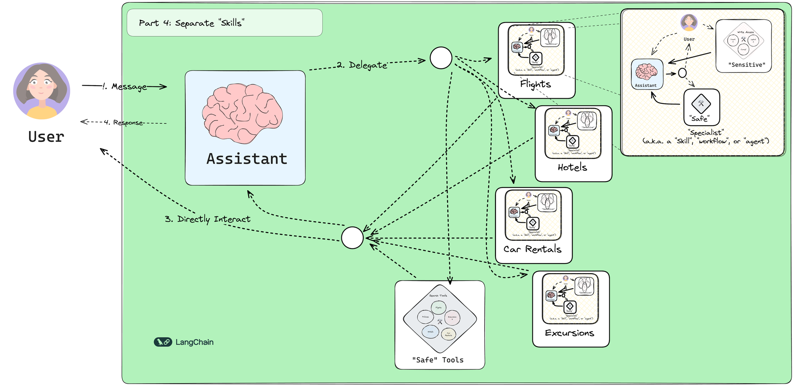

# Building a Customer Support Bot for Airline Travel

Customer support automation presents significant challenges in creating systems that reliably handle diverse tasks while maintaining positive user experiences. This implementation focuses on developing a specialized bot for airline customer service to assist with travel research and arrangements.

In this project, I developed a customer support bot using LangGraph's advanced features including interrupts and checkpointers, along with complex state management to organize tools and manage flight bookings, hotel reservations, car rentals, and excursions. The approach builds upon concepts from the LangGraph introductory materials while introducing more sophisticated patterns.

The completed system architecture follows this general design:

## Implementation Setup

### Environment Configuration

The initial phase involved setting up the development environment with necessary dependencies. The implementation uses Claude as the primary LLM and integrates several custom tools. While most tools connect to a local SQLite database, the system also incorporates web search capabilities through Tavily for comprehensive information retrieval.

Key components established during setup:

- LangGraph framework integration
- Claude LLM configuration
- SQLite database connectivity
- Tavily search API implementation
- Custom tool definitions for travel services

The toolset was designed to handle multiple aspects of travel planning while maintaining data consistency across different service types. This required careful state management to track user interactions and booking progress throughout the conversation flow.

The interrupt system allows for handling user queries that may deviate from the current workflow, while checkpointers maintain session state across interactions. This combination enables the bot to manage complex multi-step travel arrangements without losing context during extended conversations.
